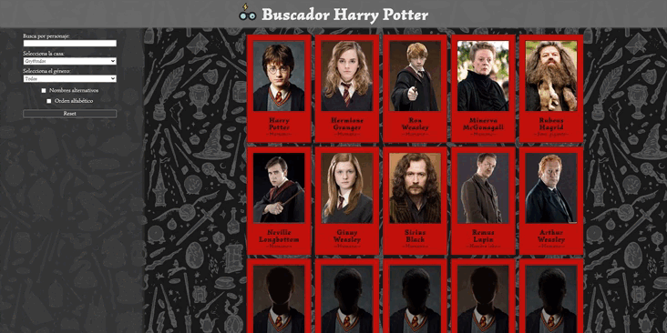

# Buscador de personajes de Harry Potter

Buscador de personajes de Harry Potter que te permite filtrarlos y visualizar información más detallada de cada personaje. Te permite filtrar por nombre, casa, género, si tiene otros nombres alternativos, y además puedes ordenar el listado. También puedes compartir las url de cada personaje porque son url únicas que se mantienen.

[](https://github.com/PaulaEPR)
[](https://github.com/tterb/atomic-design-ui/blob/master/LICENSEs)

## ¿Dónde verlo?

[Buscador de personajes de Harry Potter](https://paulaepr.github.io/buscador-personajes-harry-potter/)



## Instalación y configuración

**Requerimientos:**

- Necesitas tener `node` y `npm` instalados.

**Clonar el repositorio**

```
git clone URL
```

**Instalar las dependencias**

```
npm install
```

**Ejecutar la aplicación**

```
npm start
```

- Ve a [http://localhost:3000](http://localhost:3000) para ver la app en el navegador.

**Desplegar el entorno de producción**

```
npm run githubpages
```

# React: Ejercicio de evaluación

El ejercicio consiste en desarrollar una página web con un listado de personajes de Harry Potter, que podemos filtrar por el nombre del personaje y casa:

- Utiliza React con SASS.
- API: [https://hp-api.herokuapp.com/](https://hp-api.herokuapp.com/)

### 1. Listado de personajes

- [x]  Un listado de resultados de personajes con la info: Foto / Nombre / Especie
    - [x]  Traducir lo que venga de la API al castellano
- [x]  Hay personajes sin foto (Vernon Dursley, Petunia Dursley o James Potter) que tienen que mostrar una imagen por defecto (sacada de [placeholder.com](http://placeholder.com/) o una imagen creada por nosotras)

### 2. Filtrado de personajes

- [x]  Filtrado por nombre con un `input`
    - [x]  Que no distinga entre mayúscula o minúscula para sacar el resultado
- [x]  Filtrado por casa con un `select`
    - [x]  Por defecto cuando carga la página debe aparecer la casa Gryffindor

### 3. Componentes del listado de personajes

- [x]  Componente para el filtro de nombre.
- [x]  Componente para el listado.
- [x]  Componente para la tarjeta de cada personaje del listado.
- [x]  Componente para el detalle de cada personaje.

### 4. Detalle de personajes

Al hacer clic sobre un personaje debe pasar lo siguiente:

- [x]  Su información aparecerá a pantalla completa (con rutas y React Router DOM)
- [x]  La información que aparecerá: Foto / Nombre / Casa / Vivo o muerto / Género / Especie /  Nombres alternativos (en caso de que los tenga)
- [x]  Link para volver a los resultados
- [x]  Traducir lo que venga de la API al castellano

### 5. Detalles de calidad

- [x]  Los filtros deben estar englobados por una etiqueta `<form />`.
- [x]  Estando en el campo de filtrado si se pulsa intro se debe impedir que el navegador navegue o cambie la ruta sin querer.
- [x]  Si se busca por un texto y no hay ningún personaje que coincida (por ejemplo "XXX") se debe mostrar un mensaje del tipo "No hay ningún personaje que coincida con la palabra XXX".
- [x]  Al entrar en el detalle de un personaje y a continuación pulsar atrás, el campo de texto debe mostrar el texto que tenía anteriormente.

### 6. BONUS: Mejoras visuales

- [x]  En el detalle del personaje:
    - [x]  Mostrar la casa con su respectivo emblema
    - [x]  Si un personaje está vivo o muerto con su respectivo icono.
- [x]  Usar algún sistema de grid para pintar el listado de personajes.
- [x]  Que funcione bien el responsive en dispositivos pequeños.

### 7. BONUS: URL compartible

- [x]  Que si visitamos la URL del detalle de un personaje directamente desde un enlace veamos el detalle del personaje. Y si se refresca también.
- [x]  Si el usuario navega a una URL inexistente mostrar un mensaje del tipo “el personaje que buscas no existe)

### 8 BONUS: Ordenación, más filtros y botón reset

- [x]  Ordenar el listado de personajes alfabéticamente por nombre
- [x]  Filtro de género
- [x]  Botón de reset para que la página vuelva al listado principal